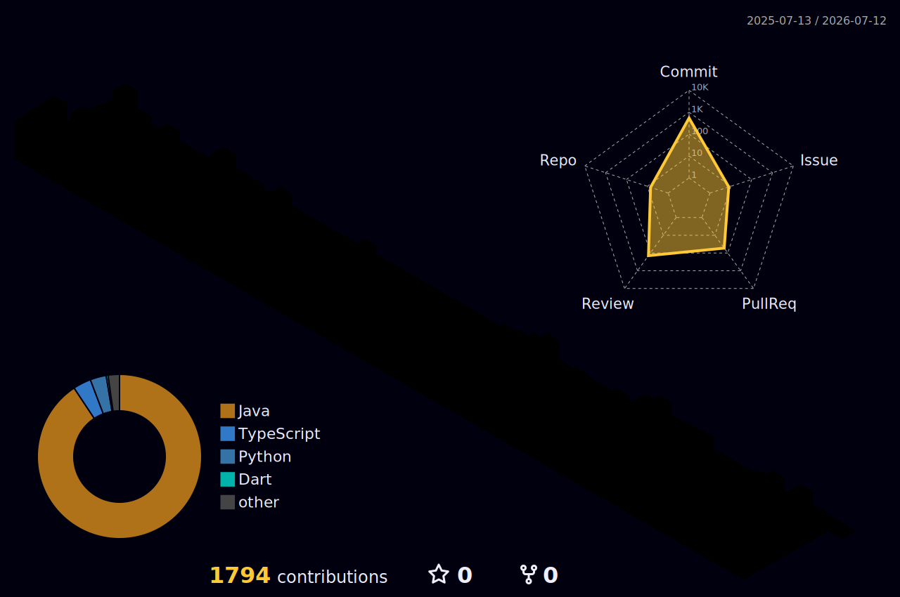

<!-- Header -->

<!-- Terminal hero (custom animated SVG, self-hosted) -->

  

  

 

## 🧑‍💻 About Me

- 🔭 **링크 인 바이오 커머스 플랫폼**을 만들고 있습니다 — Next.js 모노레포 + AWS 서버리스
- ⚡ 주문/결제를 **Step Functions Saga 패턴**으로, 검색을 **DynamoDB → EventBridge → OpenSearch** 파이프라인으로 처리합니다
- 🌱 Java/Spring 백엔드에서 출발해 지금은 **TypeScript 풀스택 + 이벤트 드리븐 아키텍처**에 집중하고 있습니다
- 🛠 Lambda 30여 개를 운영하며 DLQ/Sentry/CloudWatch 기반 모니터링 체계를 다듬는 중입니다

 

## 🚀 Tech Stack

<table>
  <tr>
    <td align="center" width="160"><b>💻 Frontend</b></td>
    <td align="center" width="440">
      
       <code>Zustand</code> · <code>Zod</code> · <code>React Hook Form</code>
    </td>
  </tr>
  <tr>
    <td align="center"><b>☁️ Serverless</b></td>
    <td align="center">
      
       <code>Lambda</code> · <code>Step Functions Saga</code> · <code>SQS + DLQ</code> · <code>EventBridge</code> · <code>Amplify</code> · <code>CDK</code>
    </td>
  </tr>
  <tr>
    <td align="center"><b>🗄 Data & Search</b></td>
    <td align="center">
      
       <code>OpenSearch</code> · <code>Upstash Redis</code>
    </td>
  </tr>
  <tr>
    <td align="center"><b>🌐 Edge & Monitoring</b></td>
    <td align="center">
      
       <code>CloudFront</code> · <code>R2 / Stream</code> · <code>CloudWatch</code> · <code>Turborepo</code>
    </td>
  </tr>
  <tr>
    <td align="center"><b>🕰 Previously</b></td>
    <td align="center">
      
    </td>
  </tr>
</table>

 

## 🌌 3D Contributions

  <picture>
    <source media="(prefers-color-scheme: dark)" srcset="profile-3d-contrib/profile-night-rainbow.svg">
    <source media="(prefers-color-scheme: light)" srcset="profile-3d-contrib/profile-season-animate.svg">
    
  </picture>

 

## 🌟 Open Source Contributions

| Project | Type | Description | PR |
| :--- | :---: | :--- | :---: |
| **[Spring Security](https://github.com/spring-projects/spring-security)** | 🔧 Build/CI | `spring-security-acl` 모듈의 Javadoc 경고 해결 및 **Zero Warnings 강제화 플러그인 적용** | **[#18493](https://github.com/spring-projects/spring-security/pull/18493)** |

 

## 📊 GitHub Stats

  

  
  

  
  

  

<!-- Commit activity graph (animated) -->

  

<!-- Contribution snake -->

  <picture>
    <source media="(prefers-color-scheme: dark)" srcset="https://raw.githubusercontent.com/alpin87/alpin87/output/github-contribution-grid-snake-dark.svg">
    <source media="(prefers-color-scheme: light)" srcset="https://raw.githubusercontent.com/alpin87/alpin87/output/github-contribution-grid-snake.svg">
    
  </picture>

<!-- Footer -->

